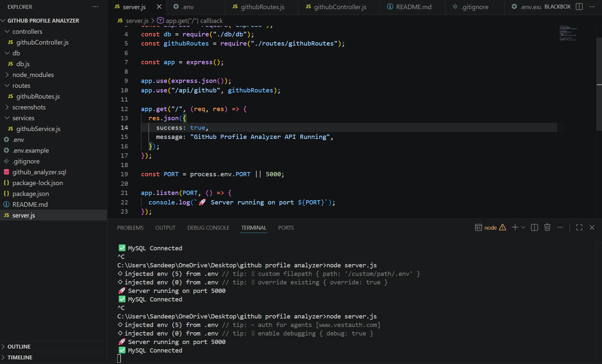
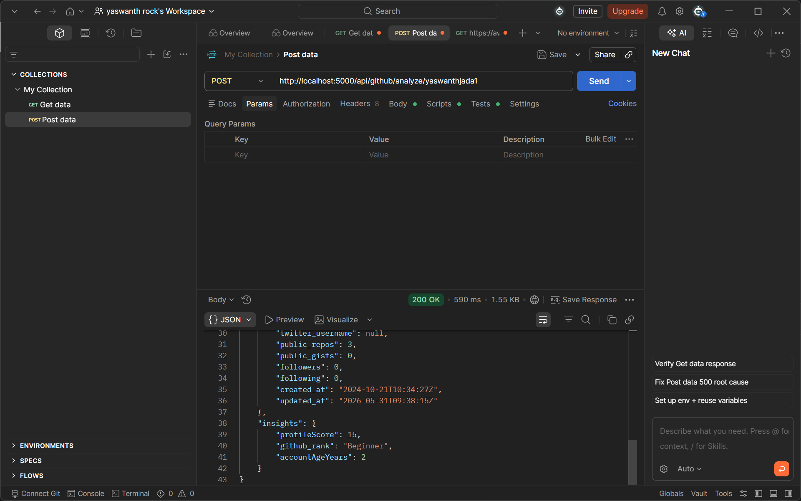
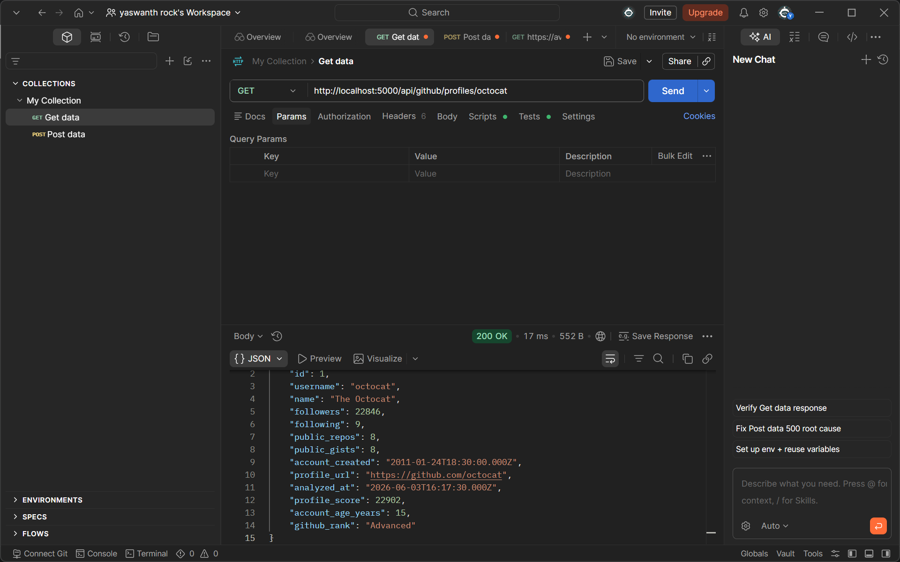

# GitHub Profile Analyzer API

## Overview

GitHub Profile Analyzer API is a backend application built using Node.js, Express.js, and MySQL. The application fetches public GitHub profile information through the GitHub REST API, generates useful insights, and stores the analysis results in a MySQL database.

This project demonstrates API integration, backend development, database management, and data analysis concepts.

---

## Features

* Fetch public GitHub profile data using a username
* Store profile information in MySQL
* Calculate custom Profile Score
* Calculate Account Age
* Assign GitHub Rank based on profile activity
* Retrieve all analyzed profiles
* Retrieve a specific analyzed profile
* Automatically update existing profiles on re-analysis
* RESTful API architecture

---

## Tech Stack

### Backend

* Node.js
* Express.js

### Database

* MySQL

### External API

* GitHub REST API

### Testing Tools

* Postman

### Version Control

* Git & GitHub

---

## Project Structure

```text
github-profile-analyzer/
│
├── controllers/
│   └── githubController.js
│
├── routes/
│   └── githubRoutes.js
│
├── services/
│   └── githubService.js
│
├── db/
│   └── db.js
│
├── screenshots/
│   ├── vs-ss.png
│   ├── postmanpost-ss.png
│   └── postmanget-ss.png
│
├── .env.example
├── .gitignore
├── github_analyzer.sql
├── package.json
├── package-lock.json
├── README.md
└── server.js
```

---

## Installation

### Clone the Repository

```bash
git clone <repository-url>
cd github-profile-analyzer
```

### Install Dependencies

```bash
npm install
```

### Configure Environment Variables

Create a `.env` file in the root directory:

```env
PORT=5000

DB_HOST=localhost
DB_USER=root
DB_PASSWORD=your_password
DB_NAME=github_analyzer
```

### Start the Server

```bash
node server.js
```

Server will run on:

```text
http://localhost:5000
```

---

## Database Schema

The application stores profile analysis data in the `profiles` table.

### Stored Fields

| Field             | Description                  |
| ----------------- | ---------------------------- |
| username          | GitHub username              |
| name              | User's name                  |
| followers         | Number of followers          |
| following         | Number of following          |
| public_repos      | Public repositories          |
| public_gists      | Public gists                 |
| account_created   | Account creation date        |
| profile_url       | GitHub profile URL           |
| profile_score     | Calculated profile score     |
| github_rank       | Beginner / Advanced / Expert |
| account_age_years | Account age in years         |
| analyzed_at       | Analysis timestamp           |

---

## API Endpoints

### Analyze GitHub Profile

**POST**

```http
/api/github/analyze/:username
```

Example:

```http
POST /api/github/analyze/octocat
```

---

### Get All Profiles

**GET**

```http
/api/github/profiles
```

Returns all analyzed profiles stored in the database.

---

### Get Profile by Username

**GET**

```http
/api/github/profiles/:username
```

Example:

```http
GET /api/github/profiles/octocat
```

Returns analysis details of a specific GitHub profile.

---

## Custom Insights

### Profile Score Formula

```text
Profile Score =
Followers +
(Public Repositories × 5) +
(Public Gists × 2)
```

### GitHub Rank Logic

| Score Range   | Rank     |
| ------------- | -------- |
| 0 - 10000     | Beginner |
| 10001 - 50000 | Advanced |
| Above 50000   | Expert   |

### Account Age

Calculated from the GitHub account creation date.

---

## Sample Profiles Tested

* octocat
* torvalds
* yaswanthjada1

---

## Screenshots

### Project Structure



### Analyze GitHub Profile API



### Get Stored Profiles API



---

## Future Improvements

* Repository-level analysis
* Most used programming languages
* Contribution statistics
* Swagger API documentation
* User authentication
* Pagination and filtering
* Dashboard frontend

---

## Author

### Yaswanth Jada

B.Tech Computer Science & Engineering (Data Science)

GitHub: https://github.com/yaswanthjada1

Portfolio: https://yaswanthpersonalportfolio.netlify.app/

LinkedIn: https://linkedin.com/in/yaswanth-jada

---

Built as part of a Node.js Internship Assignment.
